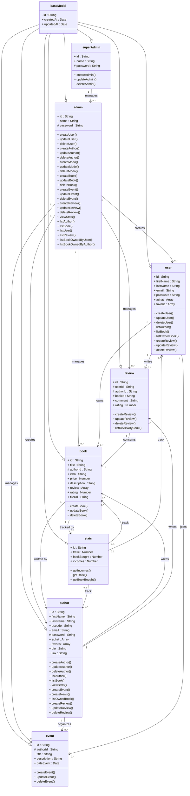

```mermaid
classDiagram
direction TB

class baseModel {
  - id : String
  + createdAt : Date
  + updatedAt : Date
}

class superAdmin {
  + id : String
  + name : String
  # password : String
  ~ createAdmin()
  ~ updateAdmin()
  ~ deleteAdmin()
}

class admin {
  + id : String
  + name : String
  # password : String
  ~ createUser()
  ~ updateUser()
  ~ deleteUser()
  ~ createAuthor()
  ~ updateAuthor()
  ~ deleteAuthor()
  ~ createModo()
  ~ updateModo()
  ~ deleteModo()
  ~ createBook()
  ~ updateBook()
  ~ deleteBook()
  ~ createEvent()
  ~ updateEvent()
  ~ deleteEvent()
  ~ createReview()
  ~ updateReview()
  ~ deleteReview()
  ~ viewStats()
  ~ listAuthor()
  ~ listBook()
  ~ listUser()
  ~ listReview()
  ~ listBookOwnedByUser()
  ~ listBookOwnedByAuthor()
}

class author {
  + id : String
  + firstName : String
  + lastName : String
  + pseudo : String
  + email : String
  # password : String
  + achat : Array
  + favoris : Array
  + bio : String
  + link : String
  ~ createAuthor()
  ~ updateAuthor()
  ~ deleteAuthor()
  ~ listAuthor()
  ~ listBook()
  ~ viewStats()
  ~ createEvent()
  ~ createNews()
  ~ listOwnedBook()
  ~ createReview()
  ~ updateReview()
  ~ deleteReview()
}

class user {
  + id : String
  + firstName : String
  + lastName : String
  + email : String
  # password : String
  + achat : Array
  + favoris : Array
  ~ createUser()
  ~ updateUser()
  ~ deleteUser()
  ~ listAuthor()
  ~ listBook()
  ~ listOwnedBook()
  ~ createReview()
  ~ updateReview()
  ~ deleteReview()
}

class stats {
  + id : String
  + trafic : Number
  + bookBought : Number
  + incomes : Number
  ~ getIncomes()
  ~ getTrafic()
  ~ getBookBought()
}

class book {
  + id : String
  + title : String
  # authorId : String
  + isbn : String
  + price : Number
  + description : String
  + review : Array
  + rating : Number
  + fileUrl : String
  ~ createBook()
  ~ updateBook()
  ~ deleteBook()
}

class event {
  + id : String
  # authorId : String
  + title : String
  + description : String
  + dateEvent : Date
  ~ createEvent()
  ~ updateEvent()
  ~ deleteEvent()
}

class review {
  + id : String
  # userId : String
  # authorId : String
  # bookId : String
  + comment : String
  + rating : Number
  ~ createReview()
  ~ updateReview()
  ~ deleteReview()
  ~ listReviewByBook()
}

baseModel --|> superAdmin
baseModel --|> admin
baseModel --|> author
baseModel --|> user
baseModel --|> book
baseModel --|> stats
baseModel --|> event
baseModel --|> review

superAdmin "1" --> "0..*" admin : manages
admin "1" --> "0..*" user : creates
admin "1" --> "0..*" author : creates
admin "1" --> "0..*" book : manages
admin "1" --> "0..*" event : manages
admin "1" --> "0..*" review : manages

author "1" --> "0..*" book : writes
author "1" --> "0..*" event : organizes
author "1" --> "0..*" review : writes

user "1" --> "0..*" review : writes
user "1" --> "0..*" event : joins
user "1" --> "0..*" book : owns

book "1" --> "1" author : written by
book "1" --> "0..1" stats : tracked by

stats "0..1" --> "0..*" author : track
stats "0..1" --> "0..*" book : track
stats "0..1" --> "0..*" user : track

review "1" --> "1" book : concerns


%% style baseModel
%% style superAdmin
%% style admin
%% style author
%% style user
%% style book
%% style review
%% style event
%% style stats
```
