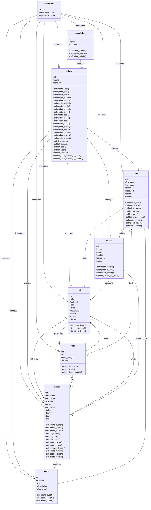

```mermaid
classDiagram
direction TB
class baseModel{
-id : str
+created at : time
+updated at : time
}
class superAdmin{
+id
+name
#password
~def create_admin()
~def update_admin()
~def delete_admin()
}
class admin{
+id
+name
#password
~def create_user()
~def update_user()
~def delete_user()
~def create_author()
~def update_author()
~def delete_author()
~def create_modo()
~def update_modo()
~def delete_modo()
~def create_book()
~def update_book()
~def delete_book()
~def create_event()
~def update_event()
~def delete_event()
~def create_review()
~def update_review()
~def delete_review()
~def view_stats()
~def list_author()
~def list_book()
~def list_user()
~def list_review()
~def list_book_owned_by_user()
~def list_book_owned_by_author()
}
class author{
+id
+first name
+last name
+pseudo
+email
#password
+achat
+favoris
+bio
+link
~def create_author()
~def update_author()
~def delete_author()
~def list_author()
~def list_book()
~def view_stats()
~def create_event()
~def create_news()
~def list_owned_book()
~def create_review()
~def update_review()
~def delete_review()
}
class user{
+id
+first name
+last name
+email
#password
+achat
+favoris
~def create_user()
~def update_user()
~def delete_user()
~def list_author()
~def list_book()
~def list_owned_book()
~def create_review()
~def update_review()
~def delete_review()
}
class stats{
+id
+trafic
+book_bought
+incomes
~def get_incomes()
~def get_trafic()
~def get_book_bought()
}
class book{
+id
+title
#authorid
+isbn
+price
+description
+review
+rating
+file_url
~def create_book()
~def update_book()
~def delete_book()
}
class event{
+id
#authorid
+title
+description
+date_event
~def create_event()
~def update_event()
~def delete_event()
}
class review{
+id
#userid
#authorid
#bookid
+comment
+rating
~def create_review()
~def update_review()
~def delete_review()
~def list_review_by_book()
}
baseModel --|> superAdmin : Inheritance
baseModel --|> admin : Inheritance
baseModel --|> author : Inheritance
baseModel --|> user : Inheritance
baseModel --|> book : Inheritance
baseModel --|> stats : Inheritance
baseModel --|> event : Inheritance
baseModel --|> review : Inheritance

superAdmin "1" --> "0..*" admin : manages
admin "1" --> "0..*" user : creates
admin "1" --> "0..*" author : creates
admin "1" --> "0..*" book : manages
admin "1" --> "0..*" event : manages
admin "1" --> "0..*" review : manages

author "1" --> "0..*" book : writes
author "1" --> "0..*" event : organizes
author "1" --> "0..*" review : writes

user "1" --> "0..*" review : writes
user "1" --> "0..*" event : joins
user "1" --> "0..*" book : owns

book "1" --> "1" author : written by
book "1" --> "0..1" stats : tracked by

stats "0..1" --> "0..*" author : track
stats "0..1" --> "0..*" book : track
stats "0..1" --> "0..*" user : track

review "1" --> "1" book : concerns

%% style baseModel
%% style superAdmin
%% style admin
%% style author
%% style user
%% style book
%% style review
%% style event
%% style stats
```
